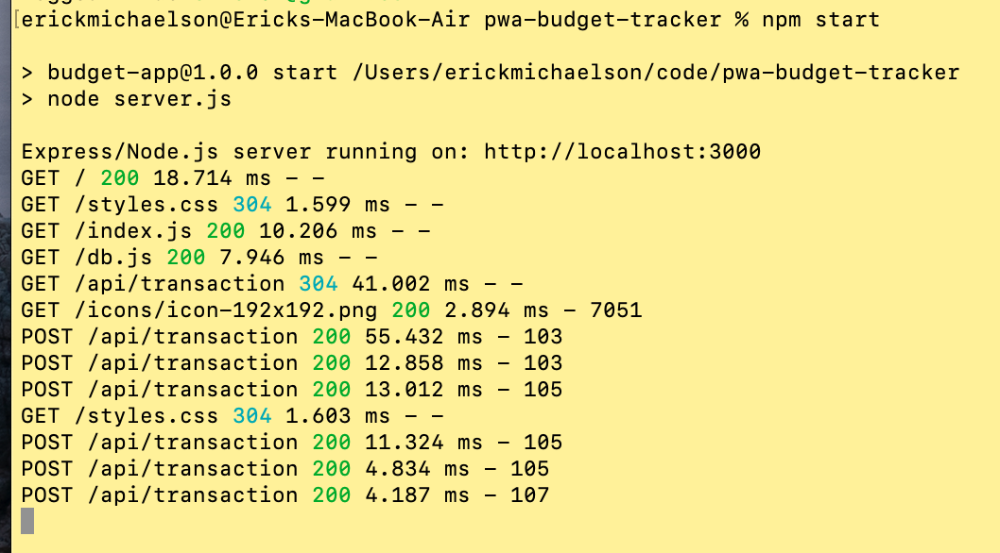

# Welcome to the readme for progressive web application, Budget Tracker!

<!--  -->

## About 
This application is meant to demonstrate using database functionality offline using indexedDB to store data on the client side. 
 The data then reupdates with the server when the user returns online. 

## Installation and Usage
Using safari, or another browser that enables bookmarking web applications directly to your mobile device, a user can bookmark install
this web application onto their home screen. This will enable the web application to function similarly to how an app would, whether
or not the user has service where they are using the applicaiton. 

## Questions
github: [erickmichaelson](https://github.com/erickmichaelson)
email: erick4michaelson@gmail.com